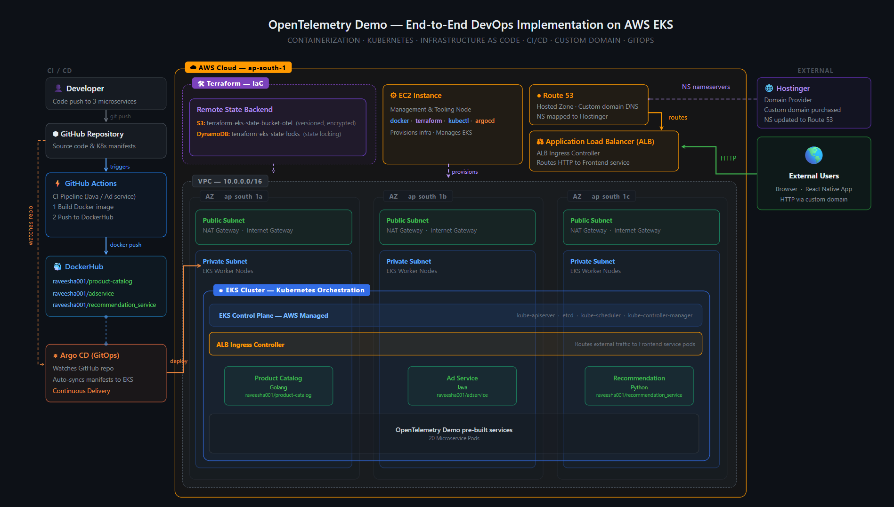

#  OpenTelemetry Demo on AWS EKS

> A real-world DevOps project deploying a **20-microservice** e-commerce application on AWS EKS with full CI/CD automation, Infrastructure as Code, and a custom domain - built to gain hands-on experience with industry standard tools and practices.

## 📌 Project Overview
 
This project uses the open-source [OpenTelemetry Astronomy Shop Demo](https://opentelemetry.io/docs/demo/) as the application base - a production-like e-commerce platform with 20 polyglot microservices. The goal was to implement the full DevOps lifecycle from containerization to deployment, with real cloud infrastructure provisioned using code.
 
**Three microservices were selected for custom containerization:**
 
| Microservice | Language | DockerHub Repository |
|---|---|---|
| Product Catalog | Go | `raveesha001/product-catalog` |
| Ad Service | Java | `raveesha001/adservice` |
| Recommendation | Python | `raveesha001/recommendation_service` |


## 🏗️ Architecture
 

 
> *High-level view of the DevOps toolchain, AWS infrastructure, and microservice deployment pipeline.*
 
The architecture covers five major layers:
 
- **CI Pipeline** - GitHub Actions builds and pushes Docker images on every code push
- **GitOps Delivery** - Argo CD watches the GitHub repo and syncs Kubernetes manifests to EKS
- **AWS Infrastructure** - EKS cluster provisioned inside a multi-AZ VPC using Terraform
- **Kubernetes Orchestration** - All 20 services deployed as pods across 3 availability zones
- **Secure Public Access** - Custom domain routed through Route 53 and ALB Ingress Controller


## 🛠️ Tech Stack
 
### Cloud & Infrastructure
| Tool | Purpose |
|---|---|
| AWS EKS | Managed Kubernetes cluster |
| AWS EC2 | Management instance (kubectl, terraform, argocd) |
| AWS VPC | Network isolation across 3 availability zones |
| AWS ALB | Application Load Balancer with Ingress Controller |
| AWS Route 53 | DNS hosting and custom domain routing |
| AWS S3 | Terraform remote state backend (versioned + encrypted) |
| AWS DynamoDB | Terraform state locking |
| Hostinger | Custom domain provider (NS delegated to Route 53) |

### DevOps Toolchain
| Tool | Purpose |
|---|---|
| Terraform | Infrastructure as Code — provisions entire AWS stack |
| Docker | Containerization of 3 custom microservices |
| DockerHub | Container image registry |
| Kubernetes | Container orchestration |
| GitHub Actions | CI pipeline — build and push Docker images |
| Argo CD | CD/GitOps — auto-deploys manifest changes to EKS |


## 🔄 CI/CD Flow
 
```
Developer pushes code
        │
        ▼
GitHub Repository (triggers on push)
        │  
        ▼
GitHub Actions CI Pipeline (docker build + docker push)
        │  
        ▼
DockerHub (new image tag)
        │
        ├──────────────────────────────┐
        │  (update K8s manifest)       │  (Argo CD watches repo)
        ▼                              ▼
GitHub Repo (manifest update)    Argo CD detects change
                                       │  kubectl apply
                                       ▼
                                 EKS Cluster (new pods)
                                       │
                                       ▼
                               Updated application live
```
 
## 📖 Key Learnings
 
- **Containerization** - Packaging polyglot microservices (Go, Java, Python) into Docker images and managing separate DockerHub repositories per service
- **Container Orchestration** - Deploying and managing 20 microservices in Kubernetes across a multi-AZ EKS cluster
- **Infrastructure as Code** - Building an EKS cluster within a VPC using Terraform modules, with remote state managed in S3 and DynamoDB
- **CI/CD Automation** - Implementing a complete pipeline where a single code push triggers image build, registry push, and automatic Kubernetes deployment via GitOps
- **AWS Networking** - Designing VPCs with public/private subnet separation, NAT Gateways, and ALB-based ingress for secure external access
- **GitOps** - Using Argo CD to declaratively manage cluster state, with GitHub as the single source of truth
- **DNS & Custom Domains** - Delegating nameservers from a third-party domain provider to Route 53 and wiring up a custom hostname to an AWS load balancer

## 🔗 References
 
- [OpenTelemetry Demo - Architecture](https://opentelemetry.io/docs/demo/architecture/)
- [Terraform AWS GitHub Repo](https://github.com/Raveesha-Induwara/devops-project-aws)
